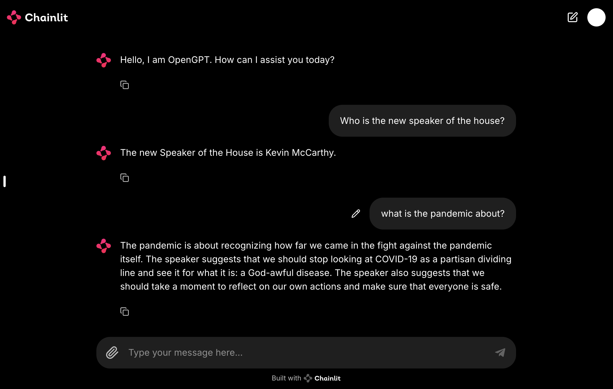

# OpenGPT

OpenGPT is a versatile chatbot framework designed to handle various document formats and provide accurate information based on the context. The framework integrates with multiple language models, including OpenAI, Gemini, and LaMini, each tailored to different use cases and requirements.

## Project Structure

The project contains the following key directories:

- **[OpenGPT/Gemini/](OpenGPT/Gemini/)** - Contains integration code for the Gemini API, including utilities for interacting with Gemini’s NLP models.
- **[OpenGPT/OpenAI/](OpenGPT/OpenAI/)** - Contains integration code for the OpenAI API, including utilities for leveraging OpenAI’s models.
- **[OpenGPT/LaMini/](OpenGPT/LaMini/)** - Contains integration code for LaMini models, including utilities for using these models in NLP tasks.

## Tech Stack

- **OpenAI API**: For natural language processing and embeddings.
- **Gemini**: For advanced generative AI tasks.
- **LaMini**: For offline capabilities and document handling.
- **Text Extraction**: Tesseract OCR for optical character recognition.
- **Image Processing**: PIL (Python Imaging Library).
- **Backend**: Flask (Python).
- **Frontend**: React (JavaScript).
- **Session Management**: Chainlit.
- **Vector Store**: ChromaDB.

## Snapshots

## Contributing

If you would like to contribute to the project, please fork the repository and submit a pull request with your changes. Follow the guidelines provided in each directory for specific contribution instructions.

## License

This project is licensed under the MIT License - see the [LICENSE](LICENSE) file for details.

## Contact

For any questions or support, please reach out to [Nabiel](mailto:msyednabiel@gmail.com).
